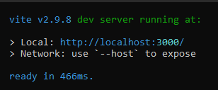

## Frontend Testing
The frontend project is created using [Vite](https://vitejs.dev/).
In order to run the project locally, NodeJS version 12.2.0 or later is needed.

- First, install NodeJS by using [this link](https://nodejs.org/en/).
- Next, navigate to the frontend folder (InTruck/Frontend) within the command prompt/terminal
- Type `npm i` to automatically install all the dependencies required by the project.
- Type `npm run dev` to start the local deployment of the frontend project.
- Finally open the deploying by ctrl+clicking on the text `http://localhost:3000x/`

